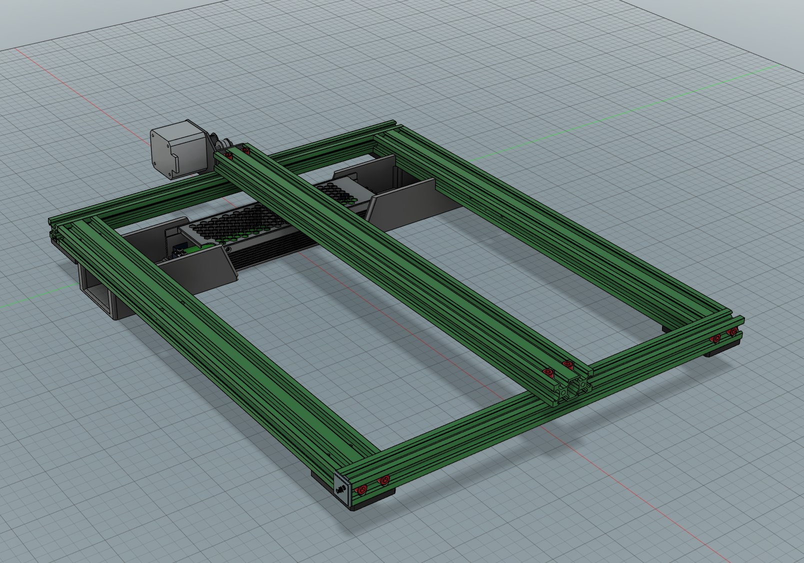

# Creality-CR-10s-Stinger
LHStinger inspired modifications for my CR-10s

First stage is to get rid of the clumsy external control box of the CR-10s. Ultimate goal is to have all the electronics located beneath the lower frame so that any future enclosure can safely segregate the electronics from the heated build area.

Parts needed for power:
- Mean Well UHP-350-24 [https://www.amazon.co.uk/dp/B07MVLP41L]
- IEC Switched Inlet [https://www.amazon.co.uk/dp/B0D261KJTN]

Location of the new Mean Well PSU:

